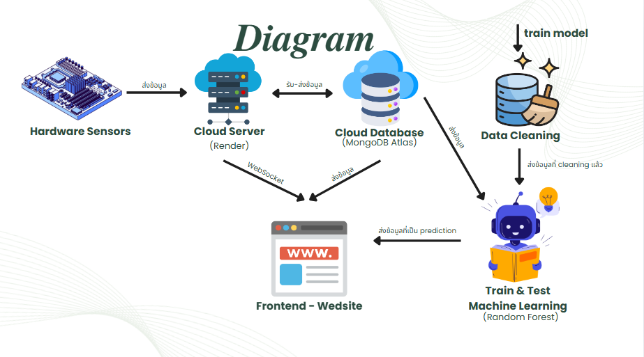
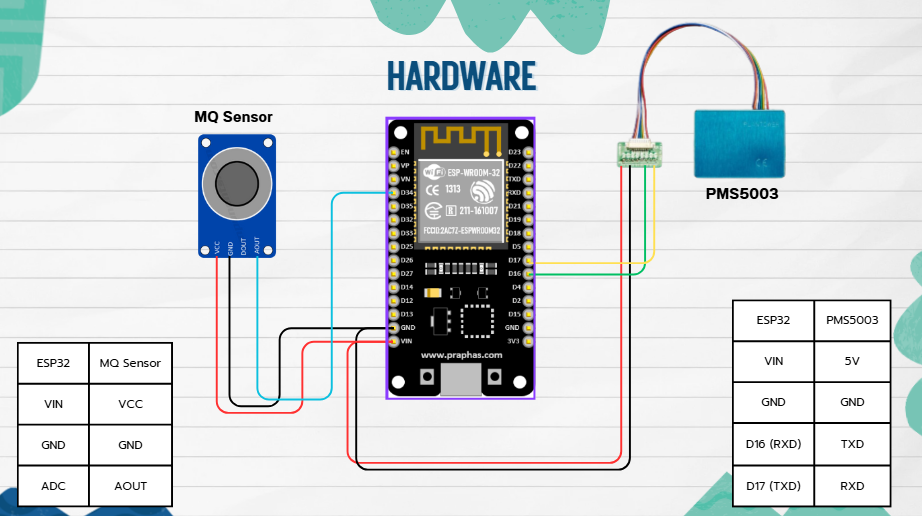

# Weather-Forecasting-Website-Project-
## Description
ระบบทำนายคุณภาพอากาศในมหาวิทยาลัย พัฒนาด้วย **Node.js, Express, MongoDB, MQTT, และ WebSocket (Socket.IO)**  
รองรับการเก็บข้อมูลจากเซ็นเซอร์จริง (PM2.5, PM10, CO, NO₂, SO₂, O₃) และดึงข้อมูลจาก API ภายนอก  
มี Dashboard สำหรับแสดงข้อมูลแบบ Real-time และรองรับการนำ Machine Learning มาทำนายคุณภาพอากาศในอนาคต

## Features
- เชื่อมต่อกับ **MQTT Broker** เพื่อรับข้อมูลจากเซ็นเซอร์ (ESP32 + Sensor Module)
- บันทึกข้อมูล Sensor และ Weather ลง **MongoDB Atlas**
- ดึงข้อมูลจาก **Weather API / OpenWeather** เพื่อใช้ประกอบการวิเคราะห์
- REST API: 
  - `/latest` → ข้อมูลล่าสุด  
  - `/api/sensors` → ข้อมูลทั้งหมด
- **WebSocket (Socket.IO)** ส่งข้อมูลแบบ Real-time ไปยัง Dashboard
- Dashboard UI แสดง: อุณหภูมิ, ความชื้น, ความเร็วลม, PM2.5, PM10, CO, NO₂, SO₂, O₃
- รองรับการทำนายคุณภาพอากาศ (Predicted AQI) ด้วย Machine Learning

## Tech Stack
- **Backend**: Node.js, Express, Socket.IO, MQTT.js
- **Database**: MongoDB, Mongoose
- **Frontend**: HTML, CSS, JavaScript (Socket.IO Client)
- **External APIs**: WeatherAPI, OpenWeather
- **Hardware**: ESP32, PMS5003, MQ-7, MQ-131, MQ-136

